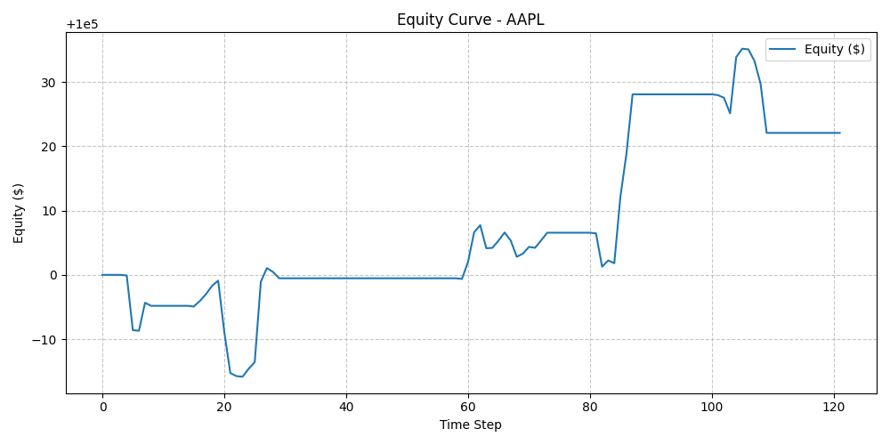

# 🚀 Trader-DQN: Reinforcement Learning with Optimized Pipelines & Feature Engineering



**Trader-DQN** is a Deep Q-Learning based trading framework that combines powerful **pipelines_features** and **optimization pipelines** to learn risk-adjusted trading strategies from real market data.  
The system integrates feature extraction, training optimization, and evaluation into a modular pipeline structure for robust and reproducible results.

---

## 🧩 Key Highlights

- 🧮 **Pipelines-Driven Architecture:**  
  Every component — from data ingestion to environment simulation — flows through modular pipelines for feature generation, transformation, and optimization.

- ⚙️ **Advanced Optimization Pipelines:**  
  Implements Dueling DQN with Double Q-Learning, soft target updates, and adaptive epsilon decay for stable convergence.

- 🧠 **Pipelines_Features Framework:**  
  Combines RSI, MACD, Stochastic, Bollinger Bands, OBV, EMA, and ATR into a unified normalized feature set, optimized for time-dependent reinforcement learning.

- 📈 **Risk-Adjusted Reward Optimization:**  
  Reward function uses rolling volatility normalization to promote smooth, risk-sensitive policy learning.

---

## 🧱 Project Architecture

```
trader-dqn/
├── src/
│   ├── agents/              # DQN agent optimization logic
│   ├── envs/                # Trading environment pipelines
│   ├── data/                # Data ingestion & caching (yfinance)
│   ├── feature_pipeline.py  # Core pipelines_features builder (feature engineering + normalization)
│   ├── train.py             # Training optimization pipeline
│   ├── evaluate.py          # Evaluation & visualization pipeline
│   ├── replay_buffer.py     # Memory optimization for experience replay
│   ├── utils/               # Metrics (Sharpe, drawdown) & utilities
│   └── signals.py           # Rule-based signal pipelines (RSI/MACD/BB)
│
├── configs/config.yaml       # Config-driven training & pipeline settings
├── Images/AAPL_EQUITY_IMAGE.png
├── Makefile                  # CLI shortcuts (train/eval)
├── Dockerfile                # Containerized runtime
└── README.md
```

---

## ⚙️ Core Pipelines_Features

| Category | Feature | Description |
|:--|:--|:--|
| Momentum | **RSI** | Relative Strength Index for trend strength |
| Trend | **MACD** | Moving Average Convergence Divergence |
| Oscillator | **Stochastic %K/%D** | Momentum oscillator for overbought/oversold zones |
| Volatility | **Bollinger Bands** | Dynamic price bounds |
| Volume | **OBV** | On-Balance Volume (buy/sell flow) |
| Moving Averages | **EMA 20/50** | Smoothed trend indicators |
| Risk | **ATR** | Average True Range for volatility adjustment |

➡️ All features are built via `feature_pipeline.py`, normalized using rolling windows, and stacked into state tensors for model input.

---

## 🔬 Optimization Techniques

**Trader-DQN** employs multiple levels of optimization pipelines:

1. **Model Optimization:**
   - Adam optimizer (`lr=0.00025`)
   - Huber (SmoothL1) loss for stable gradients
   - Soft target updates (`τ = 0.005`)
   - Gradient clipping (`‖∇‖ ≤ 10`)

2. **Exploration Optimization:**
   - Linear epsilon decay (`1.0 → 0.05`) across 80,000 steps
   - Epsilon-greedy action selection for controlled exploration

3. **Reward Optimization:**
   - Risk-adjusted reward using:
     ```python
     reward = equity_change / (rolling_std + 1e-8)
     ```
   - Promotes smoother portfolio growth and penalizes volatility spikes.

4. **Replay Optimization:**
   - Efficient replay buffer for temporal experience storage.
   - Tuned `batch_size=64` and `buffer_size=150000` for memory efficiency.

---

## 🧩 Training Pipeline

```bash
make train
```

Example Output:
```
Step 200000 | Equity=100012.99 | Avg Loss=0.21440 | Epsilon=0.0500
Training complete. Final equity: 100012.99
```

---

## 📊 Evaluation Pipeline

```bash
make eval
```

Example Output:
```
Evaluation Metrics:
  final_equity   : 100022.10
  roi_%          : 0.0221
  sharpe         : 1.0940
  max_drawdown   : -0.0002
```

---

## 🐳 Docker Optimization Pipeline

### Build Image
```bash
docker build -t trader-dqn .
```

### Train in Container
```bash
docker run --rm -it -v $(pwd):/app trader-dqn
```

### Evaluate in Container
```bash
docker run --rm -it -v $(pwd):/app trader-dqn python -m src.evaluate
```

---

## 🔄 Integrated Pipelines Overview

| Stage | Pipeline | Description |
|:--|:--|:--|
| Data | `yfinance_loader` | Fetches & preprocesses OHLCV data |
| Feature | `feature_pipeline.py` | Builds and normalizes indicators |
| Environment | `TradingEnv` | Market simulation with stop-loss/TP |
| Agent | `DQNAgent` | Learns via policy optimization |
| Evaluation | `evaluate.py` | Backtests & visualizes model results |

---

## 🧭 Future Optimization

- ⚡ GPU-accelerated training (PyTorch CUDA)
- 🔁 Prioritized replay buffer
- 📉 Transaction cost-aware optimization
- 🧠 Multi-symbol pipelines_features learning (AAPL, MSFT, SPY)

---

## 📈 Visualization


---

**Author:** Manjunath Popuri  
**Date:** April 2025   
**Keywords:** pipelines_features · optimization · reinforcement learning · DQN · stock trading
